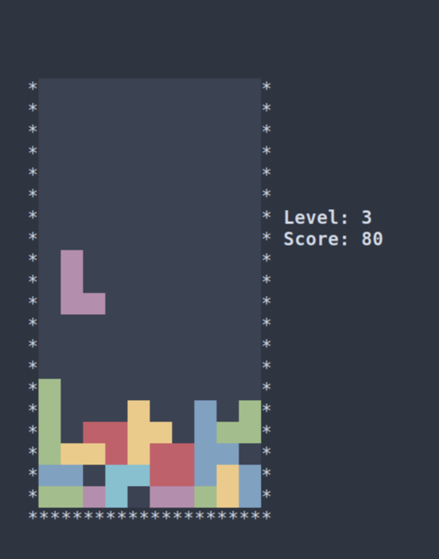

# Go Blocks

Me learning Go by writing a terminal implementation of the popular block game.

Tested on Alacritty on Linux. Cannot vouch for other OS-es and terminal emulators.



## Running

```bash
go run .
```
